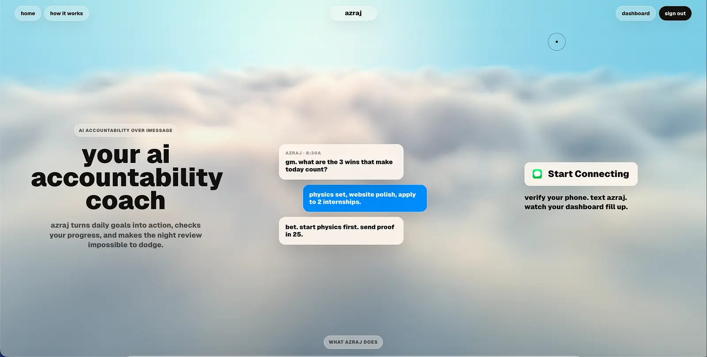
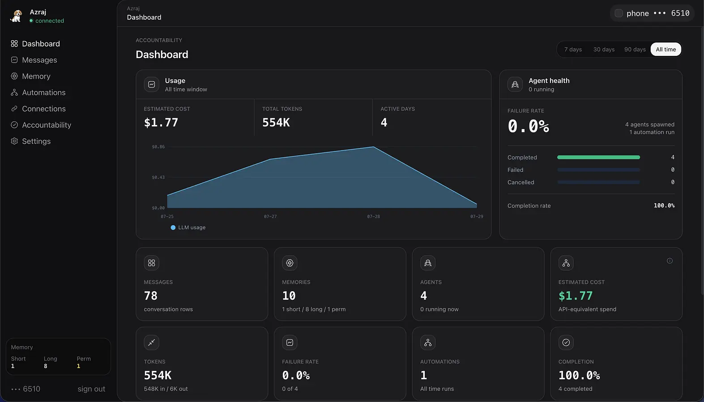

# Azraj
## description
Azraj is an AI accountability agent built through iMessage. We noticed that if someone is constantly checking up on you, then there is a higher chance that you will actually follow through and complete your goals, instead of doing everything yourself. Essentially, Azraj does exactly that. It helps you plan your day making sure it's relevant to your long term goals, messages you throughout the day to follow up, and allows for you to journal with it at night. Furthermore, as Azraj keeps your conversation memory in context, every week it gives you a personalized person and mindset of the week to reflect and learn from. Finally, Azraj has integrations with different platforms such as google calendar, gmail, and slack to help create a more cohesive workflow. 

## features
Automations built directly into the dashboard, allowing users to have recurring messages. 
Azraj has a streak system built directly into it, as when the user texts Azraj for the first time in a new day, a unique streak card will be sent. 
Azraj has a weekly mindset and person of the week feature built into it. The agent will analyze the user and what tasks they are focusing on and customize a person and mindset that fits their goals.
Azraj adapts to how the user talks, including increasing or decreasing the weight of slang and emojis
Able to send reminders to pressure the user into accomplish their tasks

## how to use/set up
1. Local checklist
- Fork the repo: https://github.com/realRSB/Azraj.git
- cd to the repo and run
```
npm install
```
- and then run
```
npm run setup
```
- With the setup, sign in to the different platforms (convex, sendblue, composio, claude, codex)
Install ngrok: on mac =
```
brew install ngrok
```
- Do ngrok config add-authtoken <token>

For website test
In one terminal run: 
```
npm run dev
```
in another terminal run 
```
npm run web:dev
```

For desktop app test
For first time runtime do 
```
npm run desktop:setup
```
Then run 
```
npm run desktop:dev
```

2. Production checklist
Open the website [Dashboard link](azraj.tech)
Currently it might not work because it only works on verified contacts, but that will be fixed soon because it costs $100/month for the subscription

## screenshots and demo link
Demo: [watch the Azraj walkthrough](https://drive.google.com/file/d/1CqKARPhTX1pyyzSjcG348psmlQbBcOZP/view?usp=sharing)

Landing page:


Dashboard:


## tech stack
Both the frontend and backend are written in typescript. HTTP server runs on node.js + express. Public website and local debug dashboard utilize React + Vite. Vanta.js used for cloud effects on the website. The database runs on Convex which records memory, messages, agents, and automations. Agent runtime can either run on Claude SDK or Codex. Messages are sent through sendblue to verified phone numbers, as of now. Integrations ran through sendblue(200+ integrations). Ngrok runs a local tunnel during dev. Railway pushed to main, allowing constant usage via a cloud virtual machine.

## why u made it
We made it to help address procrastination. Azraj acts like a person always checking your shoulder, seeing if you’re doing what you need to do but are too lazy to start. Having someone keeping me accountable to my goals will help me be more productive. 
 
## learning outcomes
We learned how to put the web app in the cloud using the railway so that it runs all the time. It was very cool because we had never done this before. Also we learned how to integrate things like sendblue for the messaging service, convex for the database, and composio for integrations. We learned how to deploy a website for the first time with a custom domain and update DNS records. We learned what a monorepo was and how it could be useful for our product → we shaped it like a web app, electron app, mobile, etc. We also improved our github skills through making PRs, merging, figuring out how to solve merge conflicts. We learned how to make dispatcher models, allowing an agent to use multiple subprocesses and other tools. Improved our skills at navigating editors like VS Code and Zed. 

## challenges 
We faced an issue with the agent not running at all times. During the start of the build, Azraj didn’t run constantly because it was running on the local ngrok servers which would shutdown if the terminal died. To solve this issue, we thought of using a Virtual Machine running on the cloud, Railway, allowing Azraj to run at all times given we have Claude or Codex tokens. 
Making Azraj sound like someone you would actually talk to rather than a generic chatbot
Facing the phone connectivity failures with sendblue
